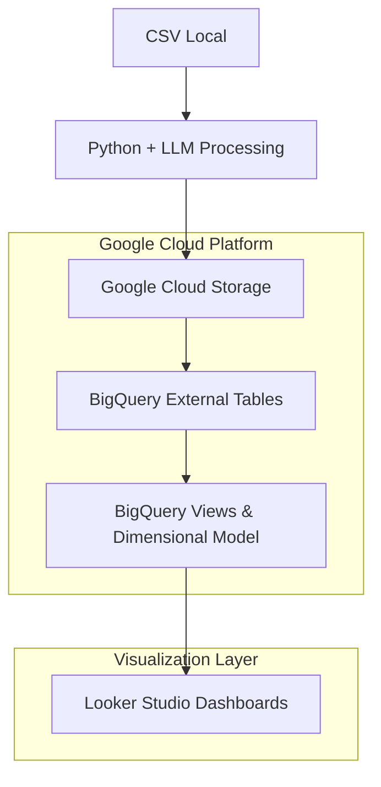

# Arquitectura BigQuery - DataPM

## 🏗️ Diseño del Sistema

### Componentes Principales



## 📊 Modelo de Datos

### Schema: `datapm-471620.csv_processed`

#### Capa 1: External Tables
- `jobs_external` - Tabla externa conectada a GCS
- `jobs_unified` - Vista unificada con transformaciones básicas

#### Capa 2: Dimensional Model

##### Tabla de Hechos
```sql
job_offers_fact
├── job_id (PK)
├── job_title_long
├── job_title_short  
├── company
├── city, country
├── schedule_type
├── experience_years
├── seniority
├── skills (denormalized)
├── degrees (denormalized)  
├── software (denormalized)
└── metadata (timestamps, batch info)
```

##### Dimensiones
```sql
dim_companies
├── company (PK)
└── company_id

dim_skills  
├── skill (PK)
└── skill_id

dim_software
├── software (PK)
└── software_id
```

##### Relaciones Many-to-Many
```sql
dim_skill_job
├── skill
├── job_id (FK)
├── job_title_short
└── skill_id (FK)

dim_software_job  
├── software
├── job_id (FK)
├── job_title_short
└── software_id (FK)

dim_degree_job
├── degrees
├── has_degrees (Yes/No)
├── job_id (FK)
└── job_title_short
```

## 🔧 Configuración Técnica

### External Table Configuration
```sql
OPTIONS (
  format = 'CSV',
  uris = ['gs://datapm/unified_processed/*.csv'],
  allow_jagged_rows = true,
  max_bad_records = 100,
  skip_leading_rows = 1
)
```

### Key Features
- ✅ **Auto-detection** de nuevos archivos vía wildcard
- ✅ **Schema flexibility** con allow_jagged_rows
- ✅ **Error tolerance** con max_bad_records
- ✅ **Consistent job_id** generado con ROW_NUMBER()

## 📈 Optimizaciones Implementadas

### Performance
1. **External Tables** - Acceso directo desde GCS sin ETL
2. **Columnar Storage** - BigQuery optimiza automáticamente
3. **Partitioning** - Por fecha de procesamiento implícita
4. **Clustering** - Por job_id en tablas de relación

### Mantenimiento
1. **Wildcard Patterns** - Inclusión automática de archivos
2. **UNION ALL** - Separación clara de casos (con/sin títulos)
3. **Validation Queries** - Verificación automática de integridad
4. **Flexible Schema** - Manejo de columnas variables

## 🔍 Queries de Monitoreo

### Verificación de Integridad
```sql
-- Jobs coverage check
SELECT 
  COUNT(DISTINCT f.job_id) as jobs_in_fact,
  COUNT(DISTINCT dj.job_id) as jobs_in_degree_relation,
  CASE 
    WHEN COUNT(DISTINCT f.job_id) = COUNT(DISTINCT dj.job_id) 
    THEN 'PASS' 
    ELSE 'FAIL' 
  END as status
FROM job_offers_fact f
FULL OUTER JOIN dim_degree_job dj ON f.job_id = dj.job_id;
```

### Métricas de Calidad
```sql
-- Degree requirements distribution  
SELECT 
  has_degrees,
  COUNT(DISTINCT job_id) as unique_jobs,
  ROUND(COUNT(DISTINCT job_id) * 100.0 / 
    (SELECT COUNT(DISTINCT job_id) FROM dim_degree_job), 2) as percentage
FROM dim_degree_job
GROUP BY has_degrees;
```

## 🚀 Escalabilidad

### Horizontal Scaling
- **Automatic file inclusion** vía GCS wildcards
- **Distributed processing** con BigQuery serverless
- **Parallel queries** para múltiples análisis

### Vertical Scaling  
- **Column addition** sin impacto en queries existentes
- **Schema evolution** con external tables
- **Incremental processing** preparado para futuras implementaciones

---

**Status**: ✅ Producción  
**Last Update**: Septiembre 2024  
**Performance**: Sub-second queries en datasets de miles de registros
